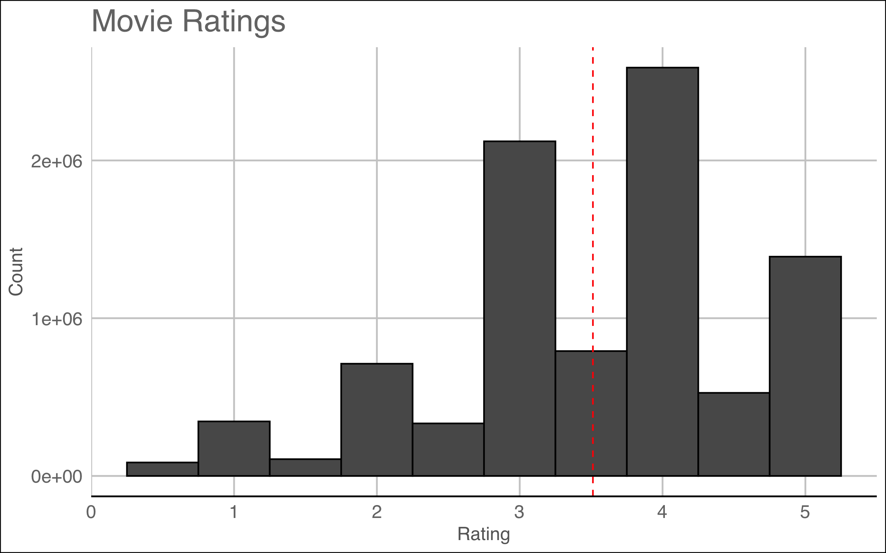
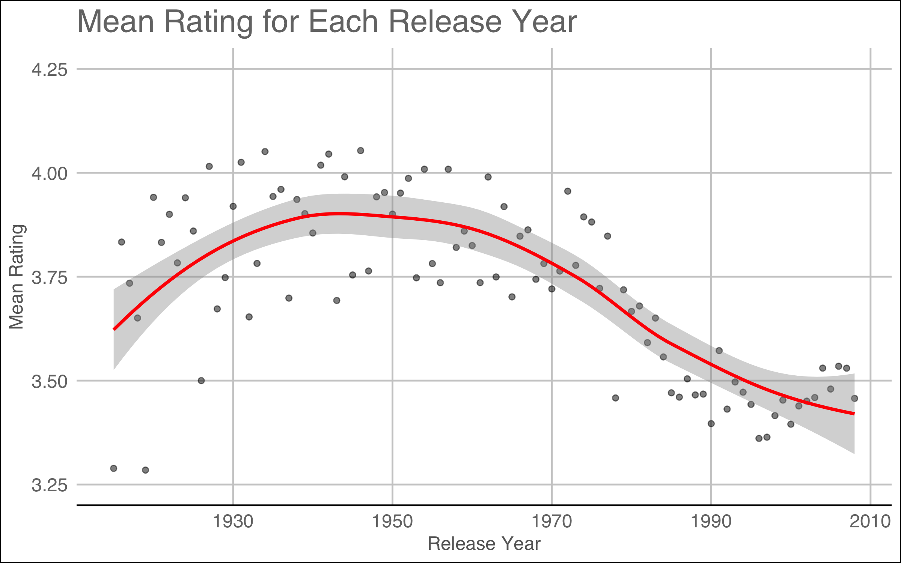
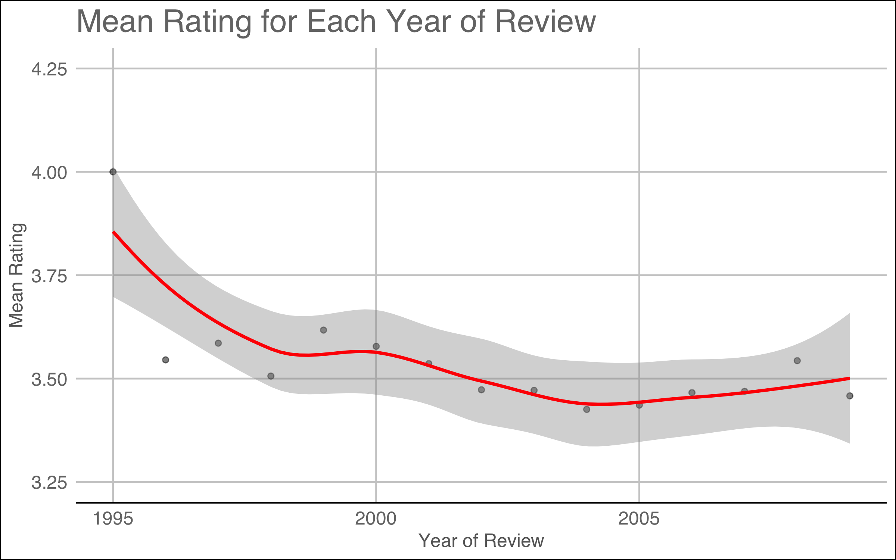
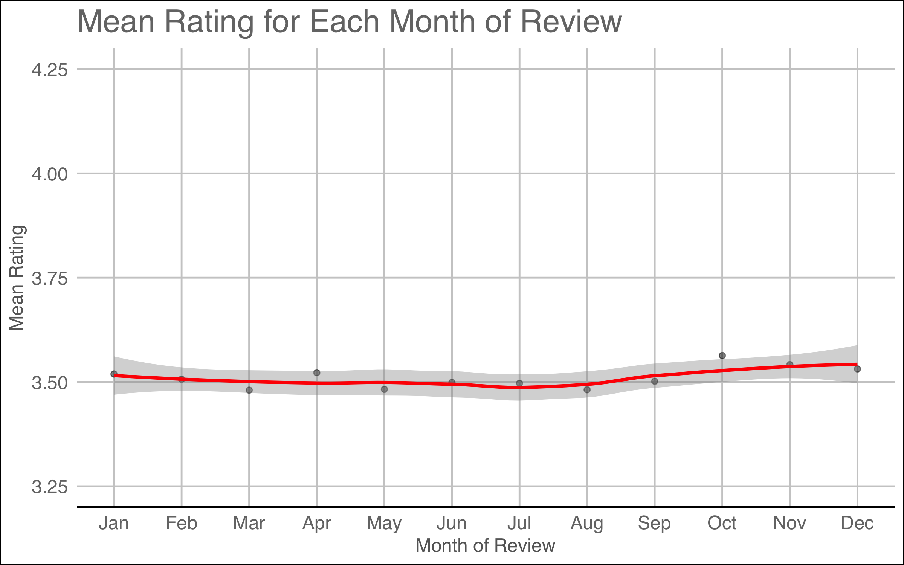
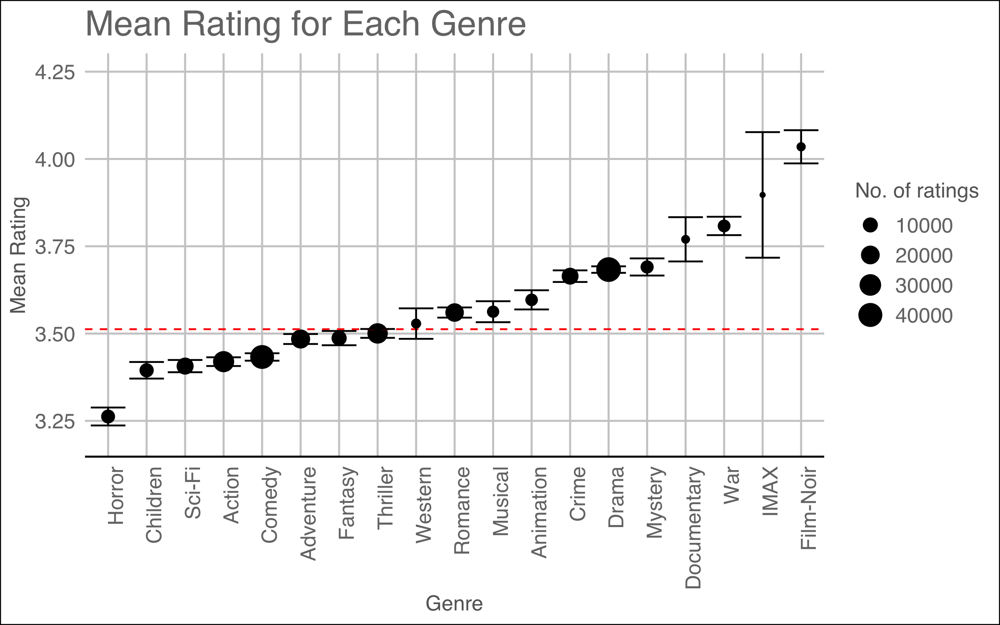
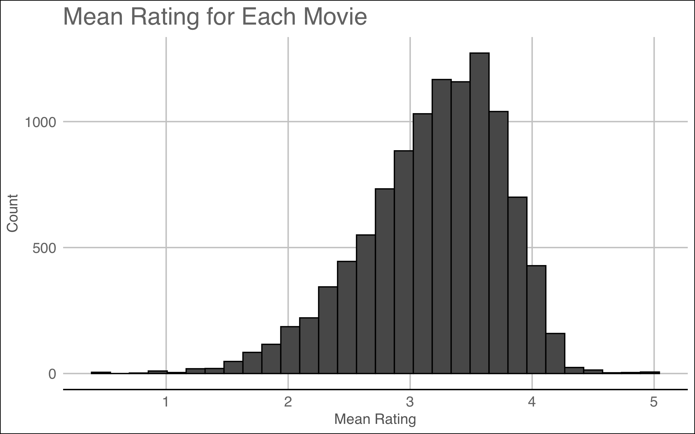
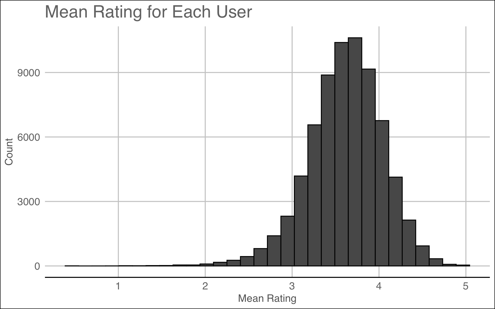
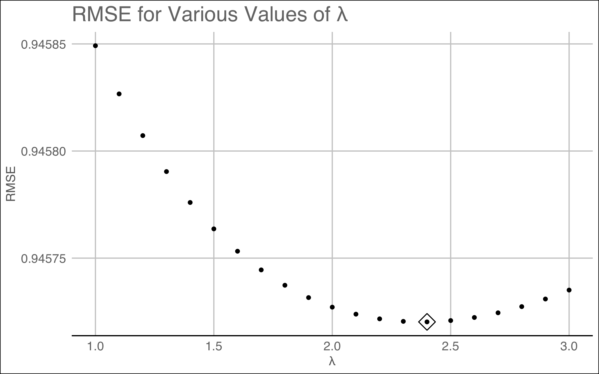
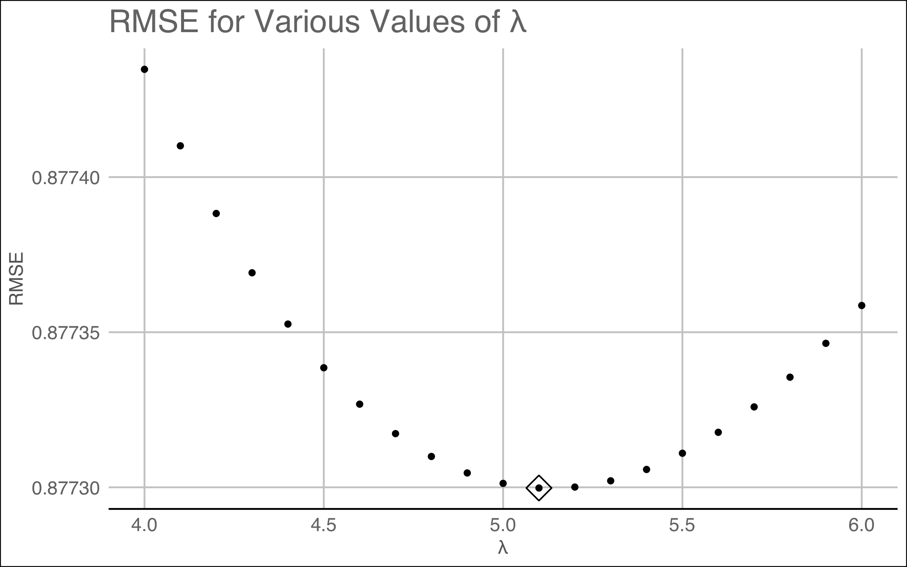
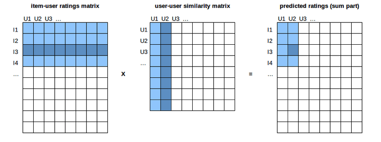

```{r setup, include=FALSE}
knitr::opts_chunk$set(echo = TRUE)

if(!require(tidyverse)) install.packages("tidyverse", repos = "http://cran.us.r-project.org")
if(!require(knitr)) install.packages("knitr", repos = "http://cran.us.r-project.org")
if(!require(kableExtra)) install.packages("kableExtra", repos = "http://cran.us.r-project.org")

library(tidyverse)
library(knitr)
library(kableExtra)
```

# Abstract
In 2006 Netflix launched an open competition - improve their in-house recommendation algorithm (Cinematch) by at least 10% and win $1,000,000. Three years later the competition was won by BellKor's Pragmatic Chaos, a seven person group consisting of statisticians, machine-learning experts and computing engineers [[1](https://bits.blogs.nytimes.com/2009/09/21/netflix-awards-1-million-prize-and-starts-a-new-contest/)].

A summary of the techniques used by BellKor's Pragmatic Chaos is available [here](http://blog.echen.me/2011/10/24/winning-the-netflix-prize-a-summary/). It discusses how techniques such as neighbourhood models, matrix factorisation and regression were used to achieve the winning result. Although gradient boosted decision trees were used to combine over 500 models, the winners noted the following [[2](http://blog.echen.me/2011/10/24/winning-the-netflix-prize-a-summary/)]:

>However, we would like to stress that it is not necessary to have such a large number of models to do well. The plot below shows RMSE as a function of the number of methods used. One can achieve our winning score (RMSE=0.8712) with less than 50 methods, using the best 3 methods can yield RMSE < 0.8800, which would land in the top 10. Even just using our single best method puts us on the leaderboard with an RMSE of 0.8890. The lesson here is that having lots of models is useful for the incremental results needed to win competitions, but practically, excellent systems can be built with just a few well-selected models.


# Introduction
This report aims to construct a movie recommendation system via machine learning methods. [Approach 1: Simple Bias] accounts for basic movie to movie and user to user variability. [Approach 2: Regularised Bias] is similar, however regularisation is implemented. This turns out to be only a minor improvement on non-regularised bias. [Approach 3: Collaborative Filtering] uses a nearest neighbours style approach. It makes use of the idea that some users are similar to other users, and that some movies are similar to other movies.

The data being worked with is the [MovieLens 10M Dataset](https://grouplens.org/datasets/movielens/10m/). It was created by [GroupLens](https://grouplens.org), a research group in the Department of Computer Science and Engineering at the University of Minnesota [[3](https://grouplens.org/datasets/movielens/10m/)]. It contains over ten million ratings for over ten thousand movies from various users.

For this report, the MovieLens 10M Dataset is split into a training and a test set (`edx` and `validation` respectively). Only the `edx` data set is used for model construction. The `validation` data set is used only for assessing model performance. The R code used to construct these data sets, models and plots is available in [this](https://github.com/alyomahoney/MovieLens_Project) GitHub repo.

# Data Exploration
The structure of the `edx` data set is shown below. This section aims to visualise and explore the data being worked with.

```{r loading_data, echo = FALSE}
load("rmd_files/rda/rmse_results.rda")
load("rmd_files/rda/rmse_values.rda")
load("rmd_files/rda/reg_motivation.rda")
load("rmd_files/rda/opt_lambdas.rda")
load("rmd_files/rda/predictions.rda")
load("rmd_files/rda/edx_str.rda")

cat(edx_str, sep = "\n")
```

## Overview of Ratings

Figure 1 shows the distribution of the ratings, with the mean rating `r round(mu, 2)` indicated by the red dashed line. The plot indicates that, although ratings are on a scale of 0.5-5, users tent to rate movies more positively than negatively. It is also apparent that integer ratings are more common than half star ratings.



## Release Year

The year in which a movie was released may not appear to be significant. However, Figure 2 illustrates that there is some kind of trend. Were there lots of really good movies release in the 40s and 50s? Why are films getting worse as time goes on? 

An extremely important observation is the vertical spread of the data across time. Mean ratings for the time period 1920-1950 are spread further from the red line than ratings post 1990 for example. This is due to there being more movies (and more ratings) made per year as time has passed.

Perhaps that explains part of the story, although there has undoubtedly been a decrease in movie ratings over the past fifty years. With the advances of the internet and affordable technology maybe the prospect of making a movie isn't that out of reach for most people. In their recent release of the iPhone 12 Pro, Apple mentioned that the likes of *American Idol* and *Mythic Quest* have been partially filmed on an iPhone. Another example is Steven Soderbergh's *Unsane*, which was filmed entirely on an iPhone 7 Plus. The fact that nearly anyone with a smart phone and an idea can make a movie is revolutionary. It does however beg the question - are more low quality movies produced because of this? It might be somewhat of a far fetched idea, but it's food for thought.



## Rating Year

Figure 3 is perhaps slightly less interesting. It does however suggest that people's attitude towards rating films has not changed much over the years. 

What about the point sitting up at the top left with a rating of four? Well, only one user in the `edx` data set was active in 1995, and they only rated two movies. It is probably safe to class this as an outlier.




## Rating Month

Speaking of uninteresting plots... 

If you ever had your suspicions that people rated movies more generously around Christmas time or during the Summer, Figure 4 is for you.



## Genre

Figure 5 illustrates the impact genre has on a movie's rating. The impact isn't actually too significant. The range between Sci-Fi and Drama is only about 0.25. The main takeaways from Figure 5 are probably that there weren't many IMAX, documentary or film-noir movies rated, and horror movies are generally pretty bad. Maybe that last point is unfair. After all, if a horror movie isn't scary then it's deemed to be poor. If it does its job and leaves the user terrified, would they be in a rush to give it a five star review?



# Approach 1: Simple Bias

This section of the report constructs models which will predict the movie ratings in the `validation` data set. Before any models are constructed, the way in which their performance is measured needs to be considered. A common loss term used to asses a model's performance is RMSE (also used in the Netflix competition). RMSE is used to assess all of the models in this report.

\begin{equation}
  RMSE = \sqrt{\sum_{i=1}^N\frac{(\hat{y}_i-y_i)^2}{N}}
\end{equation}

where $N$ is the sample size, $\hat{y}_i$ are the predicted values and $y_i$ are the corresponding observations. 


## Average Movie Rating

The first, and most simple, algorithm used to guess a user's rating for a given film would be to guess the average rating for all movies. The average movie rating across the training data set is `r round(mu, 2)`. A model which uses only this information for prediction is as follows:

\begin{equation}
  r_{u,m}=\mu +\epsilon_{u,m}
\end{equation}

where $r_{u,m}$ is the rating given by user $u$ for movie $m$, $\mu$ is the average movie rating and $\epsilon_{u,m}$ is the error term for the corresponding movie and user. The table below shows that the RMSE of this algorithm is around `r round(rmse_1, 4)`. The next section will try and improve on this.

```{r rmse_1, echo = FALSE}
kable(rmse_results %>% slice(1), caption = "Table 1: RMSE result after first model.")
```


## Movie Bias

An obvious factor to consider is that some movies are better (rated more highly) than others. This is highlighted in Figure 6 below. Instead of using the average movie rating for predictions, it may be more intuitive to use each movie's average rating. The model is then

\begin{equation}
  r_{u,m}=\mu + \beta_m +\epsilon_{u,m}
\end{equation}

where $\beta_m$ is the bias for movie $m$. 




Note that accounting for movie bias now means that there is no interest in investigating release year, as the value of information given by release year is captured in calculating the bias for each movie.

Table 2 below shows the improved RMSE of `r round(rmse_2, 4)` when accounting for movie to movie variability.

```{r movie_bias, echo = FALSE}
kable(rmse_results %>% slice(1:2), caption = "Table 2: RMSE results after second model.")
```


## Movie and User Bias

Not only do different movies get rated differently, but different users have different rating tendencies. Some users are generous whereas others are harsh. This is highlighted in Figure 7.




In the same way that the previous model accounted for movie to movie variability, this model accounts for user to user variability. Thus, the model is

\begin{equation}
  r_{u,m}=\mu + \beta_m + \beta_u +\epsilon_{u,m}
\end{equation}

where $\beta_u$ is the bias for user $u$.

One small issue with this model is that it can actually predict values outwoth the interval $[0.5, 5]$. Therefore, any predictions above/below the interval have been assigned a value of 5/0.5 respectively. Considering this only improves the RMSE by about 0.0002.

This model reduces the RMSE to `r round(rmse_3, 4)`.

```{r movie_user_bias, echo = FALSE}
kable(rmse_results %>% slice(1:3), caption = "Table 3: RMSE results after third model.")
```


# Approach 2: Regularised Bias

To motivate the idea behind regularised bias (regularised regression) the five best and worst movies - according to the [Movie Bias] model - are listed in Table 4 and Table 5 below respectively. They're not very convincing lists. What these movies have in common is that they are quite obscure - they have been rated very few times. Another way to think about this idea is: are you more likely to buy a product which one person has rated five stars, or a product which over a thousand people have rated four and a half stars? The number of reviews gives credibility to the score. 


```{r motivate_regularisation, echo = FALSE}
kable(top_five, col.names = c("Title", "$\\beta_m$", "Number of ratings"), escape = FALSE, caption = "Table 4: Top five movies according to \"Movie Bias\" model.") %>% column_spec(1, width = "5in")

kable(bottom_five, col.names = c("Title", "$\\beta_m$", "Number of ratings"), escape = FALSE, caption = "Table 5: Worst five movies according to \"Movie Bias\" model.") %>% column_spec(1, width = "5in")
```

## Regularised Movie Bias

Resularised regression is a machine learning algorithm which penalises parameter estimates which come from small sample sizes and are deemed to be somewhat unreliable. In the [Movie Bias] model the following equation was minimised to obtain the least squares estimate (LSE) for each movie bias:

\begin{equation}
  \frac{1}{N}\sum_{u,m}(r_{u,m}-\mu -\beta_m)^2.
\end{equation}

To estimate the parameters for the new model using regularised regression, the following equation is minimised:

\begin{equation}
  \frac{1}{N}\sum_{u,m}(r_{u,m}-\mu -\beta_m)^2 + \lambda\sum_m\beta_m^2
\end{equation}

where $\lambda$ is a tuning parameter which determines how much 'unreliable' parameter estimates are penalised.

With the use of calculus, it is easy to show that the values of $\beta$ that minimise this equation are defined as

\begin{equation}
  \hat{\beta}_m (\lambda) = \frac{1}{\lambda+n_m} \sum_{u=1}^{n_m}(R_{u,m}-\hat{\mu} )
\end{equation}

where $n_m$ is the number of ratings for movie $m$.

Note that when $n_m$ is small (not many people have rated the movie), $\lambda$ is having a more significant impact. When $n_m$ is large (many people have rated the movie), the effect $\lambda$ has becomes negligible. The equation also illustrates that a large value of $\lambda$ results in more shrinking (more skepticism).


This model is similar to the [Movie Bias] model however regularised regression is used to construct the movie bias parameter estimates. 5-fold cross-validation is used to choose an optimal $\lambda$. Figure 8 illustrates the mean RMSE obtained with each $\lambda$ with `r lambda_m` being the optimal choice.





The five best and worst movies accounting for regularisation are shown in Table 6 and Table 7 respectively. These results are more in line with expectations. In addition to this, the number of ratings for each movie is much higher in comparison to the tables shown in [Movie Bias].

```{r top_five_reg, echo = FALSE}
kable(top_five_reg, col.names = c("Title", "$\\beta_m$", "Number of ratings"), escape = FALSE, caption = "Table 6: Top five movies according to \"Regularised Movie Bias\" model.") %>% column_spec(1, width = "5in")

kable(bottom_five_reg, col.names = c("Title", "$\\beta_m$", "Number of ratings"), escape = FALSE, caption = "Table 7: Worst five movies according to \"Regularised Movie Bias\" model.") %>% column_spec(1, width = "5in")
```

Table 8 shows that the new model is only a slight improvement over the "Movie Bias" model. The reason for this is because only a few predictions benefit from using regularised regression. The bias estimates for movies such as *The Shawshank Redemption* and *The Godfather* don't really differ from the first model. The bias estimates for movies like *Hellhounds on My Trail* and *Satan's Tango* (see Table 4) are significantly altered, however these movies account for such a small proportion of the ratings. 


```{r movie_reg, echo = FALSE}
kable(rmse_results %>% slice(1:4), caption = "Table 8: RMSE results after fourth model.")
```


## Regularised Movie and User Bias

The idea of regularised regression can be applied to users as well as movies. When accounting for two regularised parameters there are a couple of routes to take. The following equation can be minimised:

\begin{equation}
  \frac{1}{N}\sum_{u,m}(r_{u,m}-\mu -\beta_m - \beta_u)^2 + \lambda\left(\sum_m\beta_m^2 + \sum_u\beta_u^2\right)
\end{equation}

which would mean finding an optimal $\lambda$ which simultaneously regularises both parameters. Another route is to fix the previously calculated value of $\lambda$ for the movie bias and find another $\lambda$ which regularises the user bias. Since it offers more flexibility, this model uses the latter approach. Thus, the equation to be minimised is

\begin{equation}
  \frac{1}{N}\sum_{u,m}(r_{u,m}-\mu -\beta_m - \beta_u)^2 + \lambda\sum_u\beta_u^2
\end{equation}

where $\beta_m$ are the __regularised__ parameter estimates.

Like before, the parameter estimates are defined by the following equation:

\begin{equation}
  \hat{\beta}_u (\lambda) = \frac{1}{\lambda+n_u} \sum_{m=1}^{n_u}(R_{u,m}-\hat{\mu} - \hat{\beta}_m )
\end{equation}

where $n_u$ is the number of ratings provided by user $u$.

Figure 9 illustrates the mean RMSE obtained with each $\lambda$ with `r lambda_u` being the optimal choice.



Again, this model is only a slight improvement over the "Movie + User Bias" model. The RMSE is reduced to `r round(rmse_5, 4)`.

```{r rmse_5, echo = FALSE}
kable(rmse_results %>% slice(1:5), caption = "Table 9: RMSE results after fifth model.")
```


# Approach 3: Collaborative Filtering


Collaborative filtering (CF) is a popular machine learning method used in recommendation systems. It first helps to image that ratings are stored in a matrix (a row for every user and a column for every movie). As not every user rates every movie, this matrix is going to be extremely sparse. The goal of CF is to fill in these missing values.

CF is commonly split into two groups: **user-based CF** and **item-based CF**. The motivation behind UBCF is that some users are similar to others, therefore are likely to have similar rating tendencies. For example, if you and your sibling like the same kind of films as each other, and your sibling gives a five star rating to a movie that you haven't seen, it's likely that you will enjoy the movie. The motivation behind IBCF is that some movies are similar to others. For example, if you gave *Harry Potter and the Philosopher's Stone* a one star rating it's probably true that you wouldn't enjoy *Harry Potter and the Chamber of Secrets*, because those two movies are arguably quite similar.

The following two models use UBCF and IBCF respectively. The third model is an ensemble of the two CF models.


## User-Based Collaborative Filtering

The first stage in constructing a user-based CF model is to determine what it means for users to be similar to each other. A popular measure, used in this report, is the [cosine similarity](https://en.wikipedia.org/wiki/Cosine_similarity). By taking $R$ to be a user-movie rating matrix, the cosine similarity between two users $A$ and $B$ is defined as

\begin{equation}
  sim(A, B) = \frac{\mathbf{u}_A \cdot \mathbf{u}_B}{\lVert \mathbf{u}_A\rVert \lVert \mathbf{u}_B\rVert}
\end{equation}

where $\mathbf{u}_U$ is the row vector in $R$ for user $U$. This measure is calculated using only the movies that both users rated. Once the similarities have been determined, the top $k$ users similar to each individual user are used to calculate their predicted ratings. The prediction for the rating given by user $A$ for movie $m$ is given by

\begin{equation}
  \hat{r}_{A,m} = \frac{\sum_{U\in S}sim(A, U)r_{U,m}}{\sum_{U\in S}|sim(A, U)|}
\end{equation}

Where $S$ is the set of $k$ users most similar to user $A$. This is a weighted mean of the ratings given to movie $m$ by all of the users similar to user $A$ - the ratings of users very similar to user $A$ are given more weight than the ratings given by users who are not as similar.

The idea behind UBCF is relatively simple, however problems arise when trying to implement is on large data sets. A common R package for recommender systems is __Recommendarlab__ [[4](https://cran.r-project.org/web/packages/recommenderlab/vignettes/recommenderlab.pdf)]. Although this package is very user-friendly, is does not scale well at all. In most cases it's actually impossible to use Recommenderlab with a data set as large as `edx` because it runs out of memory.

In Stefan Nikolić's blog [[5](https://blog.smartcat.io/2017/improved-r-implementation-of-collaborative-filtering/)] he presents a solution to tackle this issue. As well as using an optimized approach for calculating the similarities [[6](https://www.smartcat.io/blog/2016/recommender-systems-matrix-operations-for-fast-calculation-of-similarities/)], one of the key features is that the matrix is split up into 'chunks'. Figure 10 below is a screenshot from Nikolić's blog. It illustrates how the initial matrix, `edx` in the case of this report, is split up into chunks in preparation for similarities being calculated. This step is then iterated until the entire matrix has been accounted for.




This method is used to construct the sixth model in this report: [User-Based Collaborative Filtering]. The chosen parameters are highlighted below in Table 10. To further improve this model, these parameters can be optimised using CV. However, due to the time it takes to run the models this report only uses one set of parameters. At a later date (and with a more powerful computer) this report will be updated with optimised tuning parameters. Nikolić actually includes a script `test.R` in his [GitHub repo](https://github.com/smartcat-labs/collaboratory) which uses CV to assess model performance (using RMSE) which is convenient for optimising tuning parameters.


```{r ubcf_params, echo = FALSE}
kable(data.frame(Parameter = c("k", "Row chunk size", "Column chunk size"),
                 Value = c(100, 3300, 5000)),
      caption = "Table 10: Parameters used for UBCF.")
```


There is one small problem which needs addressed before the performance of the model can be measured. Due to the nature of the algorithm, some similarities cannot be measured. This is due to the matrix being so sparse. Therefore, some of the predictions will be missing values. A quick and easy fix for this is to replace these missing values with values from the [Regularised Movie and User Bias]. Thus, the predictions obtained from the UBCF model are defined as

\begin{equation}

  \hat{r}_{u,m} = 
  
\left\{
	\begin{array}{ll}
		\frac{\sum_{U\in S}sim(u, U)r_{U,m}}{\sum_{U\in S}|sim(u, U)|}  & \mbox{if } S \neq \emptyset \\
		\mu + \beta_m+\beta_u & \mbox{otherwise } 
	\end{array}
\right.

\end{equation}

where $S$ is the set of users that have rated movie $m$ out of the $k$ users most similar to user $u$, $sim(u,U)$ is the cosine similarity between user $u$ and user $U$,  and $\beta_m$ and $\beta_u$ are the __regularised__ movie and user biases respectively, calculated in [Regularised Movie and User Bias].

This model appears to be an improvement on all previous models, resulting in an RMSE of `r round(rmse_6, 4)`. The following section takes a similar approach, only this time considering similarities between movies.

```{r rmse_6, echo = FALSE}
kable(rmse_results %>% slice(1:6), caption = "Table 11: RMSE results after sixth model.")
```


## Item-Based Collaborative Filtering


This model is constructed in almost exactly the same way as the previous model. The underlying motivations and mathematics are the same, only this model uses similarities between movies and not users. The parameters used for this model are highlighted below in Table 12. Again, these should ideally be optimised using cross validation.

The RMSE is even better for this model, yielding a result of `r round(rmse_7, 4)`.

```{r ibcf_params, echo = FALSE}
kable(data.frame(Parameter = c("k", "Row chunk size", "Column chunk size"),
                 Value = c(100, 18000, 5500)),
      caption = "Table 12: Parameters used for IBCF.")
```

```{r rmse_7, echo = FALSE}
kable(rmse_results %>% slice(1:7), caption = "Table 13: RMSE results after seventh model.")
```


## User-Item-Based Collaborative Filtering (Ensemble)

The two CF models are great improvements on the bias models. To improve them even further, this next model ensembles the two CF models. The predictions are defined as

\begin{equation}
  \hat{r}_{u,m}= \frac{\hat{r}_{u,m}^{UBCF}+\hat{r}_{u,m}^{IBCF}}{2}
\end{equation}

where $\hat{r}_{u,i}^{UBCF}$ and $\hat{r}_{u,i}^{IBCF}$ are predictions from the UBCF and IBCF models respectively. Table 14 shows a significantly improved RMSE of `r round(rmse_8, 4)`.


```{r rmse_8, echo = FALSE}
kable(rmse_results %>% slice(1:8), caption = "Table 14: RMSE results after eighth model.")
```


# Conclusion

This report discussed a few methods used to construct recommendation systems. The best performing model was [User-Item-Based Collaborative Filtering (Ensemble)] which yielded an RMSE of `r round(rmse_8, 4)`. This improved on the first model's RMSE by over 20%.

Those interested in a more advanced approach to construct recommender systems should consult the [recosystem](www.reco) package. It provides the means to implement matrix factorisation on large data sets. It is a scalable alternative to the likes of [recommenderlab](www.recommender). The high level idea of matrix factorisation is that different movies have different features, and those features appeal to some users and not to others. These features are 'latent factors', they don't have a predetermined definition. Luis Serrano explains the concept well in [this](https://www.youtube.com/watch?v=ZspR5PZemcs) video. Matrix factorisation using recosystem improved on this report's best performing model's RMSE by just under 4%.

Many thanks are due to Rafael Irizarry, the course instructor of HarvardX's Professional Certificate in Data Science, and to the teaching staff who were always at hand to answer questions and queries raised by students. This edX series has been thoroughly enjoyable and valuable. Irizarry delivered engaging lectures and provided a range of useful coding examples throughout the series.

Another thank you is due to Stefan Nikolić and the team he worked with to create the scripts used in [Approach 3: Collaborative Filtering]. This report gives all credit to Nikolić for being able to implement CF on such a large data set.


# References

[1] Lohr, S. *Netflix Awards \$1 Million Prize and Starts a New Contest.* https://bits.blogs.nytimes.com/2009/09/21/netflix-awards-1-million-prize-and-starts-a-new-contest/ (date last accessed - 15/10/2020)

[2] Chen, E. *Winning the Netflix Prize: A Summary.* http://blog.echen.me/2011/10/24/winning-the-netflix-prize-a-summary/ (date last accessed - 15/10/2020)

[3] MovieLens *MovieLens 10M Dataset* https://grouplens.org/datasets/movielens/10m/ (date last accessed - 15/10/2020)

[4] Hahsler, M. *recommenderlab: A Framework for Developing and Testing Recommendation Algorithms. R package version 0.2-6.* (2020)

[5] Nikolić, S. *Improved R implementation of collaborative filtering* https://blog.smartcat.io/2017/improved-r-implementation-of-collaborative-filtering/ (date last accessed - 15/10/2020)

[6] Nikolić, S. *Recommender Systems: Matrix operations for fast calculation of similarities* https://blog.smartcat.io/2016/recommender-systems-matrix-operations-for-fast-calculation-of-similarities/ (date last accessed - 15/10/2020)
